# CONTRAFÁCTICO — The Org That Didn't Happen

> **See the decision your company should have made — and what it would have saved.**

Enterprise Decision Intelligence for Microsoft 365, powered by Foundry IQ-grounded evidence and MCP tools.

[](#demo-surface)
[](#architecture)
[](#mcp-endpoints)
[](#cloud-deployment)
[](#trust-safety-and-governance)
[](#license)

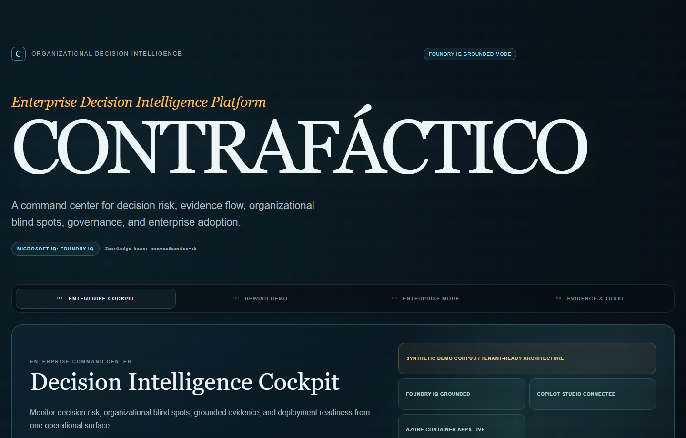

## The Problem

Bad decisions rarely fail because people are careless.

They fail because a premise was already false, a warning existed, and the right people never saw it. The evidence was present, but it disappeared inside inboxes, meeting notes, operational systems, and organizational boundaries.

Existing copilots summarize what happened. **CONTRAFÁCTICO finds the branch where the better future split away.**

It rewinds consequential decisions, locates the first contradicting fact, measures who did not see it, simulates the evidence-supported alternative, prices the avoidable gap, and watches pending decisions for the same failure signature.

## The $80K Silence

The synthetic Cordillera Components demo reconstructs one decision:

1. The X-200 March launch was approved on the premise `supplier_on_time`.
2. A supplier warning dated February 14 stated that the sensor batch would **not arrive before April**.
3. The warning contradicted the launch premise.
4. It was intended for four decision makers and read by zero.
5. The March launch proceeded, followed by stockout pressure and Q1 returns.
6. A March 31 finance artifact records **$80,000 USD in returns**.
7. The evidence-supported counterfactual acts on the warning, launches in April, and avoids the returns.

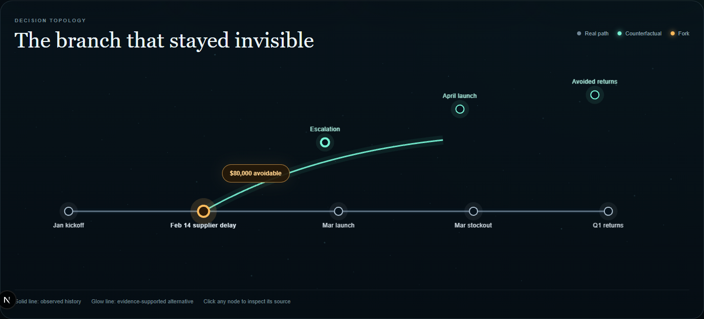

The point is not prediction theater. The branch is bounded by cited evidence. Unsupported claims are removed, and the reliability score exposes what the simulation can and cannot defend.

## What It Does

| Capability | Enterprise outcome |
| --- | --- |
| **Rewind Decision** | Reconstructs the cited sequence of premises, warnings, approvals, and outcomes. |
| **Find Branch Point** | Locates the earliest high-strength contradiction that failed to reach the decision group. |
| **Simulate Counterfactual** | Builds the alternative branch from supported evidence and drops unsupported nodes. |
| **Price the Gap** | Calculates the documented avoidable financial difference between observed and alternative outcomes. |
| **Live Fork Watch** | Detects the same low-readership contradiction pattern before a pending decision closes. |
| **Fork Fingerprint** | Finds repeated organizational blind spots across decisions and business units. |
| **Branch Reliability** | Scores citation coverage, unsupported claims, and the weakest dependency in a branch. |
| **Governance Policy Evaluation** | Applies deterministic approval controls and requires human review when policy conditions trigger. |
| **Enterprise Readiness** | Reports implemented controls and the explicit work remaining for tenant production. |
| **Enterprise Adoption** | Explains evidence onboarding, supported channels, connector contracts, and production boundaries. |

## Demo Surface

The product is available through business-user, operational, and technical surfaces.

### Microsoft 365 Copilot and Teams

The Copilot Studio agent and Power Platform custom connector are implemented and call the five-tool MCP facade. Authenticated Microsoft surfaces must be captured manually; the repository does not fabricate a Copilot conversation.

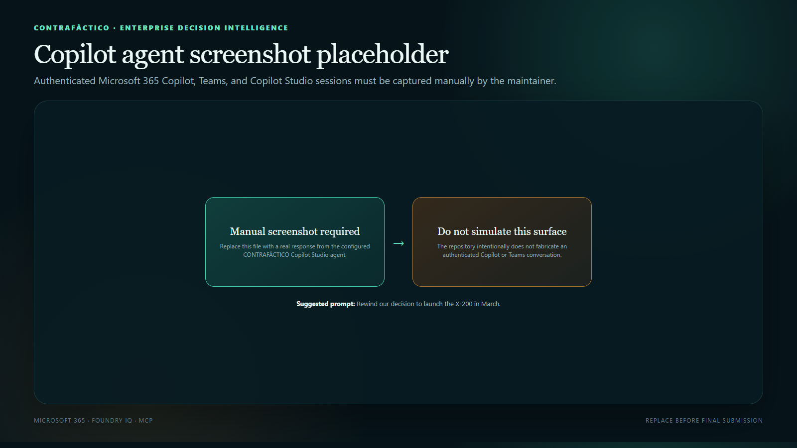

See the exact replacement steps in [the screenshot checklist](docs/submission/SCREENSHOT_CHECKLIST.md).

### Web War Room and Enterprise Cockpit

The Next.js War Room opens on an enterprise command center, while retaining the full X-200 rewind, Enterprise Mode, and Evidence & Trust views.

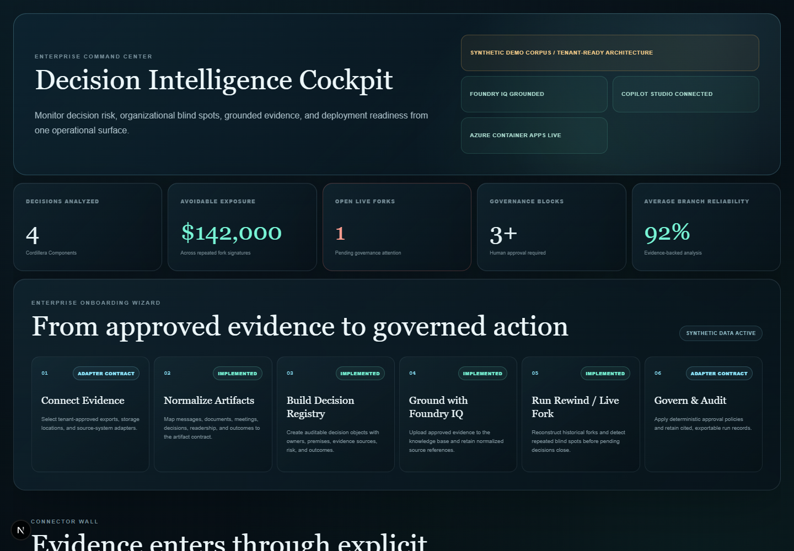

| Evidence graph | Citation inspector |
| --- | --- |
| 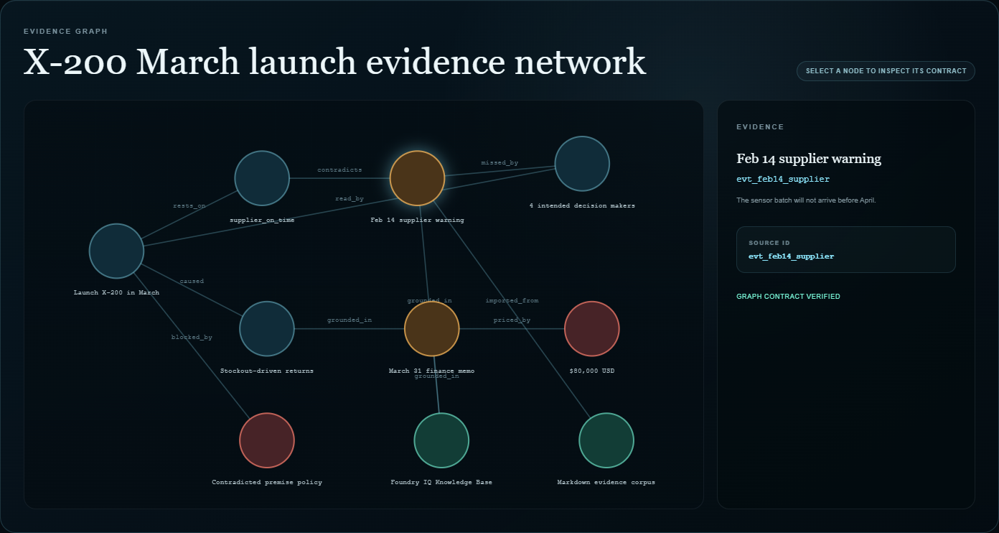 | 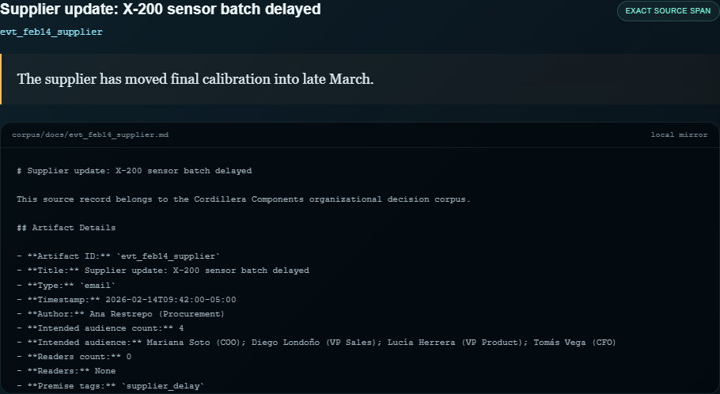 |

| Connector wall | Channel matrix |
| --- | --- |
| 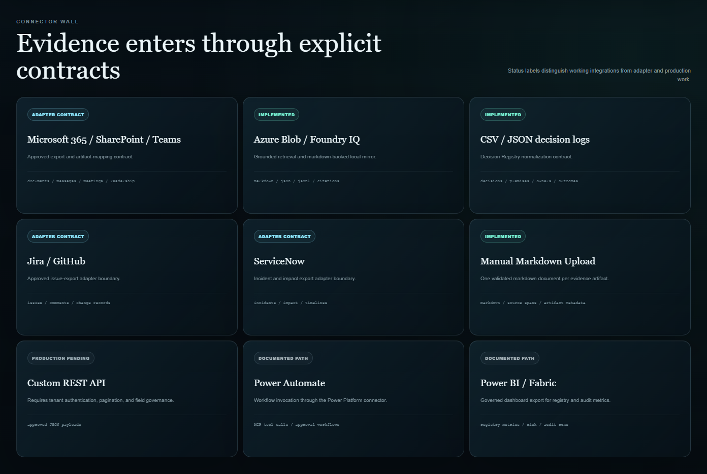 | 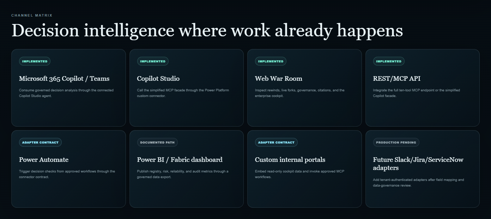 |

## Architecture

CONTRAFÁCTICO uses one grounded decision-intelligence runtime with separate surfaces for business users, technical MCP clients, and the read-only web experience.

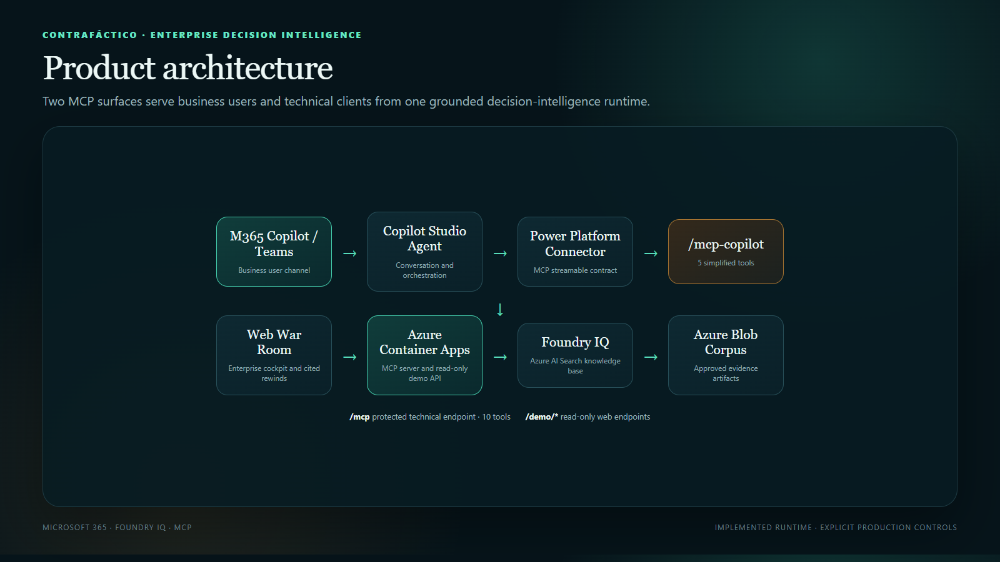

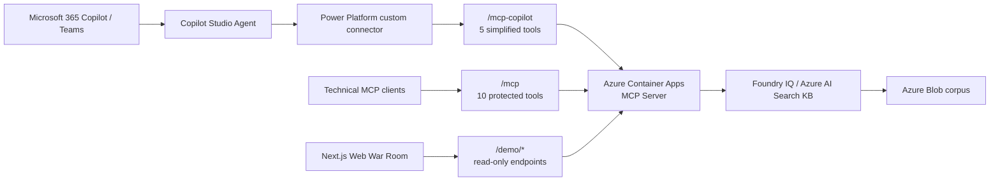

The detailed product, evidence, trust, and channel diagrams are in [docs/diagrams/architecture.md](docs/diagrams/architecture.md).

### Evidence Lifecycle

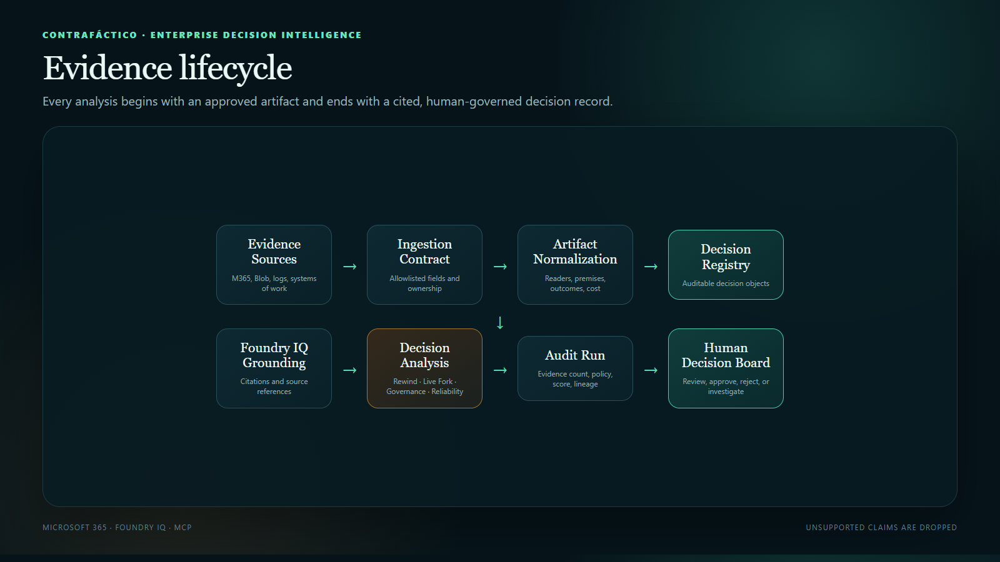

Approved evidence passes through an explicit ingestion contract, artifact normalization, the Decision Registry, Foundry IQ grounding, analysis, audit, and a human decision board.

### Production Trust Boundary

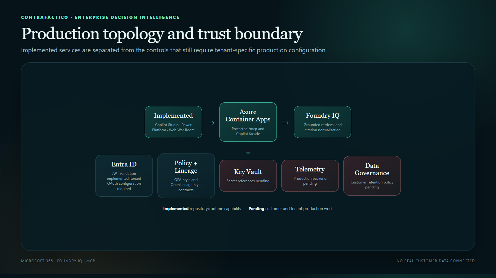

The runtime distinguishes implemented capabilities from adapter contracts, documented paths, and tenant-specific production work.

## MCP Endpoints

| Endpoint | Purpose | Tools | Security posture |
| --- | --- | ---: | --- |
| `/mcp` | Full technical Streamable HTTP MCP endpoint | 10 | Protected by `AUTH_MODE`; supports stateless and stateful transport. |
| `/mcp-copilot` | Copilot Studio-compatible facade with flat schemas | 5 | Inherits `/mcp` auth by default; public mode is limited to the demonstration connector. |
| `/demo/*` | Read-only data for the Web War Room | N/A | Governed by `DEMO_ENDPOINTS_PUBLIC` and server authentication settings. |

Public backend:

```text
https://ca-contrafactico-mcp.niceocean-5f5ede6d.eastus.azurecontainerapps.io
```

Useful safe-status routes:

```text
GET /health
GET /demo/status
GET /mcp/status
GET /mcp-copilot/status
```

## MCP Tools

### Full `/mcp` Endpoint

| Tool | Purpose |
| --- | --- |
| `rewind_decision` | Reconstruct a decision and its grounded evidence timeline. |
| `find_branch_point` | Find the earliest contradicting, low-readership artifact. |
| `simulate_counterfactual` | Generate the evidence-supported alternative branch. |
| `price_the_gap` | Calculate documented avoidable financial exposure. |
| `live_fork_watch` | Detect a repeated fork signature in a pending decision. |
| `analyze_fork_fingerprint` | Compare decisions for recurring organizational blind spots. |
| `score_branch_reliability` | Score citation coverage and unsupported branch claims. |
| `list_decision_registry` | Return normalized, auditable decision objects. |
| `evaluate_governance_policy` | Evaluate deterministic governance and human-approval rules. |
| `get_enterprise_readiness` | Report enterprise capabilities and production gaps. |

### Copilot `/mcp-copilot` Facade

| Tool | Purpose |
| --- | --- |
| `rewind_decision_summary` | Return a flattened decision rewind for Copilot Studio. |
| `detect_live_fork` | Return a flattened pending-decision warning. |
| `analyze_enterprise_readiness` | Summarize readiness and remaining production work. |
| `evaluate_decision_governance` | Explain whether a decision requires human approval. |
| `explain_enterprise_adoption` | Explain evidence sources, channels, onboarding, and limitations. |

All tool inputs use strict Zod schemas. Tool responses include `structuredContent`, and the server uses modern MCP `registerTool` APIs with Streamable HTTP transport.

## Enterprise Adoption

Another company would use CONTRAFÁCTICO through a controlled six-stage onboarding path:

1. **Connect approved evidence.** Inventory source owners, access rules, retention requirements, and allowed fields.
2. **Normalize artifacts.** Map messages, documents, meetings, decisions, readership, outcomes, and costs to the artifact contract.
3. **Build the Decision Registry.** Create auditable decisions with owners, premises, evidence, risk, lifecycle status, and outcomes.
4. **Ground with Foundry IQ.** Upload approved artifacts to the tenant knowledge base and retain normalized source references.
5. **Run Rewind and Live Fork.** Analyze historical failures and detect repeated blind spots before pending decisions close.
6. **Govern and audit.** Apply deterministic controls, require human approval, and retain cited Audit Run records.

### Evidence Sources

| Source | Current status |
| --- | --- |
| Microsoft 365, SharePoint, and Teams exports | Adapter contract |
| Azure Blob and Foundry IQ corpus files | Implemented |
| CSV and JSON decision logs | Implemented |
| Jira and GitHub exports | Adapter contract |
| ServiceNow incident exports | Adapter contract |
| Manual Markdown upload | Implemented |
| Custom REST API | Documented path |

No real customer data is connected. The repository uses only the synthetic Cordillera Components corpus.

### Delivery Channels

| Channel | Current status |
| --- | --- |
| Microsoft 365 Copilot / Teams | Implemented through the Copilot Studio agent |
| Copilot Studio | Implemented through the Power Platform MCP connector |
| Web War Room | Implemented |
| Full REST/MCP API | Implemented |
| Power Automate | Adapter contract / documented workflow path |
| Power BI / Fabric | Documented dashboard path |
| Custom internal portals | Adapter contract |
| Jira, ServiceNow, and Slack | Future tenant adapter path |

## Trust, Safety, and Governance

CONTRAFÁCTICO is decision support, not autonomous decision making.

- Every factual branch claim must resolve to grounded evidence.
- Citations preserve `source_id`, title, span when returned, and source references.
- Unsupported branch nodes are dropped rather than presented as fact.
- Branch Reliability exposes evidence coverage and the weakest supported dependency.
- The OPA-style policy preview blocks recommendations when a premise is contradicted, readership is low, and impact is material.
- Governance blocks require human approval.
- Audit Runs retain tool, evidence, reliability, policy, and outcome metadata.
- The agent never approves, rejects, purchases, deploys, or changes an operational system automatically.

The trust stack includes:

- Microsoft Entra ID validation support;
- Foundry IQ grounding;
- MCP tool contracts;
- OPA-style policy enforcement;
- OpenLineage-style evidence lineage;
- Langfuse-style observability contracts;
- Evidently-style reliability checks.

See [docs/ENTERPRISE_TRUST_STACK.md](docs/ENTERPRISE_TRUST_STACK.md).

## Implemented vs Pending

### Implemented

- Copilot Studio agent
- Power Platform custom connector
- Azure Container Apps MCP server
- Foundry IQ knowledge-base mode with local fallback
- Full ten-tool MCP endpoint
- Five-tool Copilot facade
- Stateful and stateless Streamable HTTP
- Web War Room
- Enterprise Cockpit and onboarding wizard
- Connector wall and channel matrix
- Evidence Graph and citation inspector
- Decision Registry contract
- Governance policy preview
- Branch Reliability and Fork Fingerprint
- Entra JWT validation support

### Adapter Contract or Documented Path

- Microsoft 365, SharePoint, and Teams evidence export ingestion
- Jira, GitHub, and ServiceNow mappings
- Power Automate workflows
- Power BI / Fabric dashboard export
- OpenLineage, Langfuse, Evidently, and external OPA integrations

### Pending for Real-Tenant Production

- Production Entra OAuth for the Copilot connector
- Azure Key Vault secret references
- Real tenant connector configuration
- Production telemetry backend
- Customer data governance and retention policy

## Local Development

### MCP Server

```powershell
Set-Location contrafactico-mcp-server
npm install
npm run generate:corpus
npm run build
npm run typecheck
npm run check:local
npm run dev
```

The server listens on `http://localhost:3100` by default.

Start from `.env.example`, but keep local `.env` files untracked:

```text
USE_LOCAL_CORPUS=true
AUTH_MODE=disabled
DEMO_ENDPOINTS_PUBLIC=true
MCP_TRANSPORT_MODE=stateless
```

For Foundry IQ mode, set `USE_LOCAL_CORPUS=false` and provide the required `SEARCH_*` values through the local process or deployment environment. Never commit keys.

### Web War Room

In another terminal:

```powershell
Set-Location web
npm install
$env:NEXT_PUBLIC_API_BASE_URL = "http://localhost:3100"
npm run build
npm run typecheck
npm run dev -- -p 3001
```

Open `http://localhost:3001`.

To regenerate README screenshots while both applications are running:

```powershell
Set-Location web
npm run capture:readme
```

## Cloud Deployment

The current backend runs on Azure Container Apps:

```text
https://ca-contrafactico-mcp.niceocean-5f5ede6d.eastus.azurecontainerapps.io
```

Deployment paths:

- **Backend:** Azure Container Apps using the repository Dockerfile and environment-based configuration.
- **Frontend:** Next.js application ready for Vercel with `web` as the root directory.
- **Agent:** Copilot Studio using the OpenAPI custom connector in `docs/connectors/`.
- **Grounding:** Foundry IQ / Azure AI Search knowledge base backed by approved Azure Blob artifacts.

See:

- [Vercel deployment guide](docs/DEPLOYMENT_VERCEL.md)
- [Azure and Foundry setup guide](scripts/azure/README.md)
- [Copilot connector Swagger](docs/connectors/contrafactico-mcp-copilot.swagger.yaml)

## Repository Structure

```text
contrafactico/
├── agent/                         Copilot Studio instructions
├── corpus/                        Synthetic decisions and evidence documents
├── contrafactico-mcp-server/     TypeScript MCP server
├── docs/
│   ├── assets/                    README screenshots and architecture PNGs
│   ├── connectors/                Power Platform connector definition
│   ├── diagrams/                  GitHub Mermaid architecture
│   ├── policies/                  Governance policy preview
│   └── submission/                Screenshot checklist and demo script
├── scripts/                       Corpus and Azure operations helpers
└── web/                           Next.js Enterprise Cockpit and War Room
```

## Submission Evidence Checklist

- [ ] Foundry IQ knowledge base screenshot
- [ ] Azure Container Apps overview screenshot
- [ ] Power Platform connector test screenshot
- [ ] Copilot Studio or Microsoft 365 agent response screenshot
- [x] Web War Room screenshot
- [x] Enterprise Cockpit screenshot
- [x] Evidence Graph screenshot

The exact capture names, framing, and replacement instructions are in [docs/submission/SCREENSHOT_CHECKLIST.md](docs/submission/SCREENSHOT_CHECKLIST.md). The 2:30 walkthrough is in [docs/submission/DEMO_SCRIPT.md](docs/submission/DEMO_SCRIPT.md).

## License

Licensed under the [MIT License](LICENSE).
