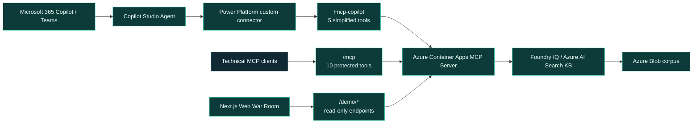
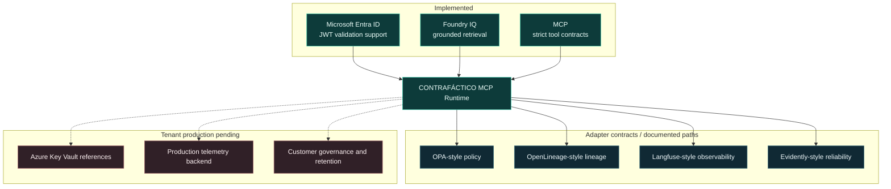
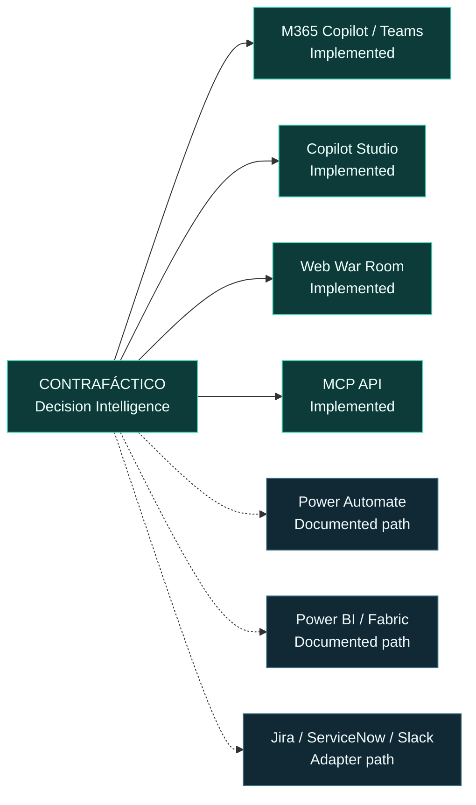

# CONTRAFÁCTICO Architecture Diagrams

These diagrams describe the current repository and deployment model. Status labels distinguish implemented capabilities from adapter contracts, documented paths, and tenant-specific production work.

## Product Architecture

## Evidence Lifecycle

```mermaid
flowchart LR
    Sources["Evidence sources<br/>M365, Blob, CSV/JSON, systems of work"]
    Contract["Ingestion contract<br/>owners, access, allowlisted fields"]
    Normalize["Artifact normalization<br/>premises, readers, outcomes, cost"]
    Registry["Decision Registry<br/>auditable decision objects"]
    Ground["Foundry IQ grounding<br/>citations and source references"]
    Analyze["Decision analysis<br/>Rewind, Live Fork, Governance, Reliability"]
    Audit["Audit Run<br/>evidence, policy, score, lineage"]
    Board["Human decision board<br/>review and approval"]

    Sources --> Contract --> Normalize --> Registry --> Ground --> Analyze --> Audit --> Board

    classDef evidence fill:#102934,stroke:#397080,color:#eff8fa;
    classDef control fill:#30251b,stroke:#c48a3a,color:#fff8ec;
    classDef human fill:#0d3b3a,stroke:#42d7b5,color:#effffb;
    class Sources,Contract,Normalize,Registry,Ground evidence;
    class Analyze,Audit control;
    class Board human;
```

## Enterprise Trust Stack

## Product Channels

